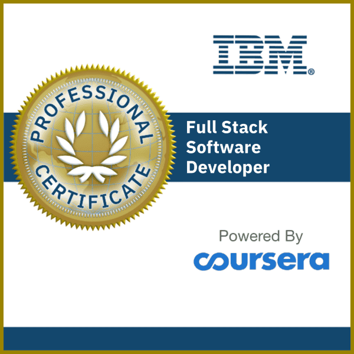
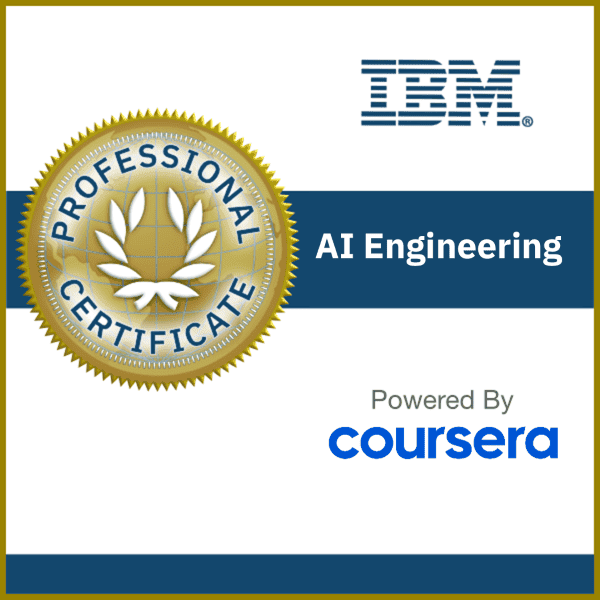
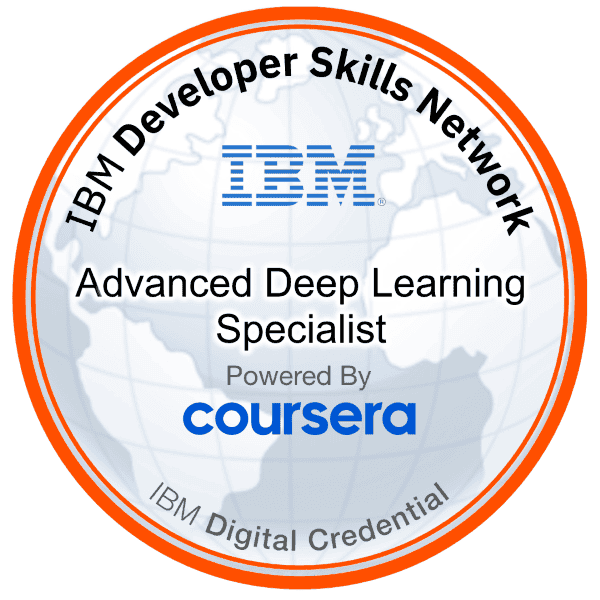
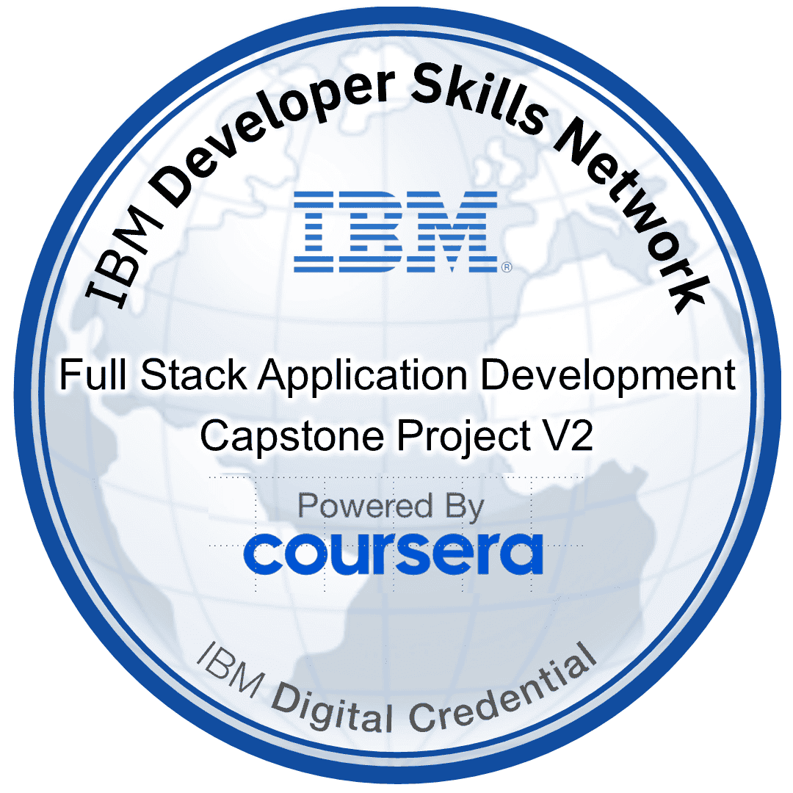
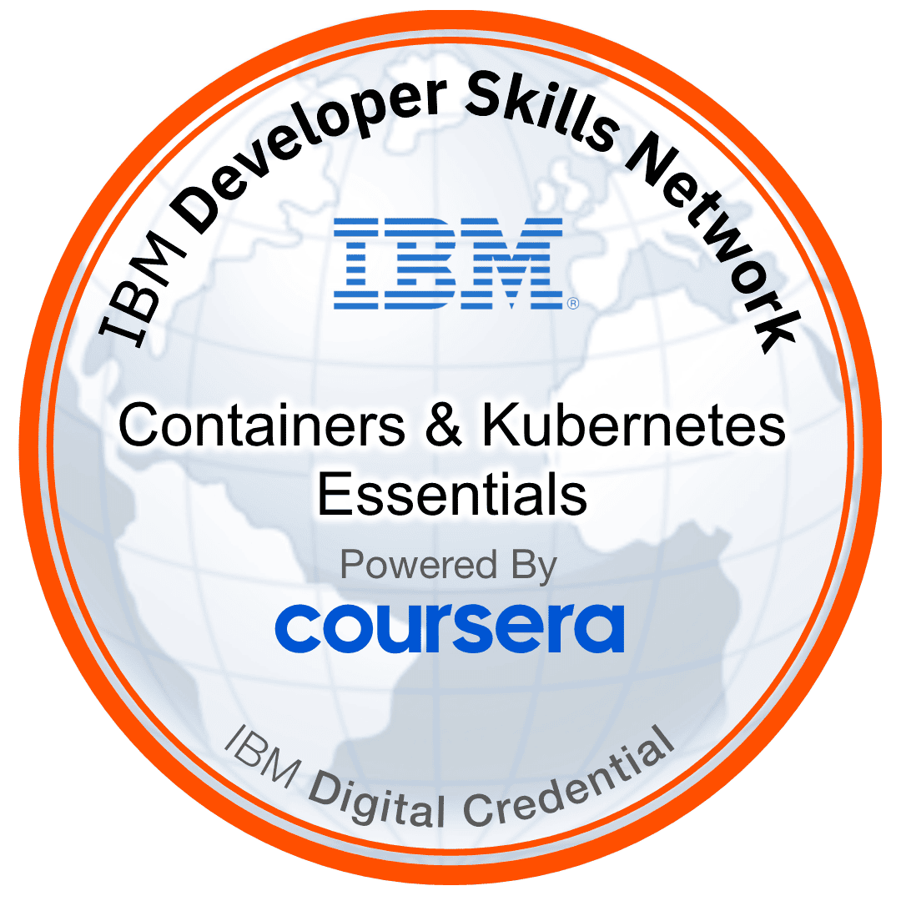
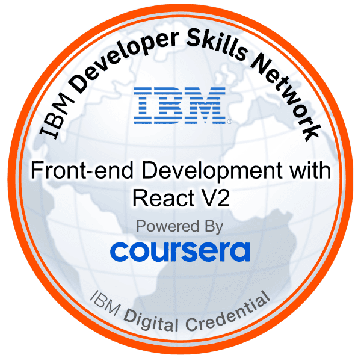

  <h1>Mustafa Yıldız</h1>
  <h3>Senior Full-Stack Developer</h3>
  
  
  
  
  
  

---

## 👨‍💻 About Me

Hello! I'm **Mustafa**, a **senior full-stack developer** with nearly **10 years of professional experience**. I've been coding since **2004**, building scalable web and mobile applications across various industries.

- 🔭 Currently working on **scalable web and mobile applications** with modern tech stacks
- 💼 **~10 years** of professional development experience | Coding since **2004**
- 🌱 Continuously learning **cloud architecture**, **microservices**, and **AI-powered development**
- 👯 Looking to collaborate on **open source projects** and innovative solutions
- 💬 Ask me about **TypeScript, Dart, C++, Node.js, NestJS, React, Flutter, Redis, RabbitMQ, MongoDB, AWS, Kubernetes**
- 📫 Reach me at: [LinkedIn](https://linkedin.com/in/mashadow) | [Upwork](https://www.upwork.com/freelancers/myildiz) | [Email](mailto:mashadow@outlook.com)
- ⚡ Fun fact: I love solving complex problems and constantly exploring new technologies

## 🛠️ Tech Stack

<table>
  <tr style="vertical-align: middle; line-height: 0;">
    <td style="vertical-align: middle; padding-right: 10px; line-height: 1;"><strong>Languages:</strong></td>
    <td style="vertical-align: middle; line-height: 0;">
      
      
      
      
      
    </td>
  </tr>
  <tr style="vertical-align: middle; line-height: 0;">
    <td style="vertical-align: middle; padding-right: 10px; line-height: 1;"><strong>Frontend:</strong></td>
    <td style="vertical-align: middle; line-height: 0;">
      
      
      
      
      
      
      
      
    </td>
  </tr>
  <tr style="vertical-align: middle; line-height: 0;">
    <td style="vertical-align: middle; padding-right: 10px; line-height: 1;"><strong>State Management:</strong></td>
    <td style="vertical-align: middle; line-height: 0;">
      
      
      
    </td>
  </tr>
  <tr style="vertical-align: middle; line-height: 0;">
    <td style="vertical-align: middle; padding-right: 10px; line-height: 1;"><strong>Backend:</strong></td>
    <td style="vertical-align: middle; line-height: 0;">
      
      
      
      
      
      
    </td>
  </tr>
  <tr style="vertical-align: middle; line-height: 0;">
    <td style="vertical-align: middle; padding-right: 10px; line-height: 1;"><strong>ORM/ODM:</strong></td>
    <td style="vertical-align: middle; line-height: 0;">
      
      
      
    </td>
  </tr>
  <tr style="vertical-align: middle; line-height: 0;">
    <td style="vertical-align: middle; padding-right: 10px; line-height: 1;"><strong>Databases & Messaging:</strong></td>
    <td style="vertical-align: middle; line-height: 0;">
      
      
      
      
      
    </td>
  </tr>
  <tr style="vertical-align: middle; line-height: 0;">
    <td style="vertical-align: middle; padding-right: 10px; line-height: 1;"><strong>Testing:</strong></td>
    <td style="vertical-align: middle; line-height: 0;">
      
      
    </td>
  </tr>
  <tr style="vertical-align: middle; line-height: 0;">
    <td style="vertical-align: middle; padding-right: 10px; line-height: 1;"><strong>Development Tools:</strong></td>
    <td style="vertical-align: middle; line-height: 0;">
      
      
    </td>
  </tr>
  <tr style="vertical-align: middle; line-height: 0;">
    <td style="vertical-align: middle; padding-right: 10px; line-height: 1;"><strong>Cloud Platforms:</strong></td>
    <td style="vertical-align: middle; line-height: 0;">
      
      
      
    </td>
  </tr>
  <tr style="vertical-align: middle; line-height: 0;">
    <td style="vertical-align: middle; padding-right: 10px; line-height: 1;"><strong>DevOps Tools:</strong></td>
    <td style="vertical-align: middle; line-height: 0;">
      
      
      
      
      
      
    </td>
  </tr>
  <tr style="vertical-align: middle; line-height: 0;">
    <td style="vertical-align: middle; padding-right: 10px; line-height: 1;"><strong>IoT & Embedded:</strong></td>
    <td style="vertical-align: middle; line-height: 0;">
      
      
    </td>
  </tr>
  <tr style="vertical-align: middle; line-height: 0;">
    <td style="vertical-align: middle; padding-right: 10px; line-height: 1;"><strong>IDE:</strong></td>
    <td style="vertical-align: middle; line-height: 0;">
      
      
      
      
      
    </td>
  </tr>
  <tr style="vertical-align: middle; line-height: 0;">
    <td style="vertical-align: middle; padding-right: 10px; line-height: 1;"><strong>AI Tools:</strong></td>
    <td style="vertical-align: middle; line-height: 0;">
      
      
      
    </td>
  </tr>
</table>

## 🏅 Certifications & Badges

<table border="0" cellpadding="0" cellspacing="0" style="width: 100%;">
  <tr style="vertical-align: middle; line-height: 1;">
    <td width="20%" align="center" style="vertical-align: middle; padding: 10px; line-height: 1;">
      
    </td>
    <td width="20%" align="center" style="vertical-align: middle; padding: 10px; line-height: 1;">
      
    </td>
    <td width="20%" align="center" style="vertical-align: middle; padding: 10px; line-height: 1;">
      
    </td>
    <td width="20%" align="center" style="vertical-align: middle; padding: 10px; line-height: 1;">
      
    </td>
    <td width="20%" align="center" style="vertical-align: middle; padding: 10px; line-height: 1;">
      
    </td>
  </tr>
  <tr style="vertical-align: middle; line-height: 1;">
    <td width="20%" align="center" style="vertical-align: middle; padding: 10px; line-height: 1;">
      
    </td>
    <td width="20%" align="center" style="vertical-align: middle; padding: 10px; line-height: 1;">
      
    </td>
    <td width="20%" align="center" style="vertical-align: middle; padding: 10px; line-height: 1;">
      
    </td>
    <td width="20%" align="center" style="vertical-align: middle; padding: 10px; line-height: 1;">
      
    </td>
    <td width="20%" align="center" style="vertical-align: middle; padding: 10px; line-height: 1;">
      
    </td>
  </tr>
  <tr style="vertical-align: middle; line-height: 1;">
    <td width="20%" align="center" style="vertical-align: middle; padding: 10px; line-height: 1;">
      
    </td>
    <td width="20%" align="center" style="vertical-align: middle; padding: 10px; line-height: 1;">
      
    </td>
    <td width="20%" align="center" style="vertical-align: middle; padding: 10px; line-height: 1;">
      
    </td>
    <td width="20%" align="center" style="vertical-align: middle; padding: 10px; line-height: 1;">
    </td>
    <td width="20%" align="center" style="vertical-align: middle; padding: 10px; line-height: 1;">
    </td>
  </tr>
</table>

